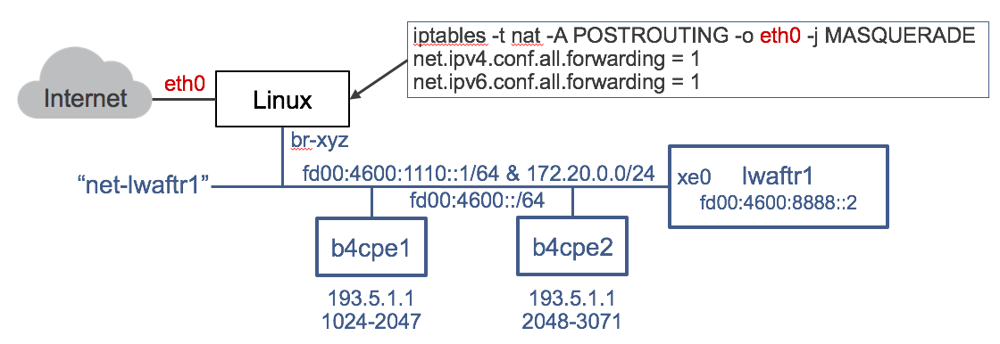

# Test cases

This directory contains a few test cases with and without physical 10GE interfaces.

## lwaftr1 (no physical ports required)

This test creates a Docker virtual network 'net-lwaftr1' that connects the vmxlwaftr Container 
lwaftr1 with B4 client simulation Containers b4cpe1 and b4cpe2 according to the following
diagram: 

:

### Preparation

Create the Docker network net-lwaftr1 with the script [create-lwaftr1-testbed.sh](create-lwaftr1-testbed.sh). This creates a virtual bridge on the Linux host with IPv4 and dual IPv6 networks: one to cnnect to the vMX lwaftr1 and the other one to the B4 clients. The virtual bridge routes between
the IPv6 networks. This is required to simulate multiple B4 clients. The script finally sets up SNAT
masquerading to hide the simulated public IPv4 network behind the Docker engines host IP address.


```
$ ./create-lwaftr1-testbed.sh
checking if docker network net-lwaftr1 already exists ... ok
need sudo privileges:
/home/mwiget/vmxlwaftr/tests
creating network net-lwaftr1 ...ok
adding IPv6 network for lwaftr1 ...  on br-d908e44e0b0c ok
adding static route to AFTR fd00:4600:8888::2 via gw fd00:4600:1110::2 ... ok
adding static route to 193.5.1.0/24 via 172.20.0.2 ... ok
Adding SNAT masquerading via interface eth0 all set.
```

### launchl vmxlwaftr  lwaftr1

Launch the vmxlwaftr Docker Container with the shell script [run-lwaftr1.sh](run-lwaftr1.sh). The container remains in the foreground. It uses the Junos configuration found in [lwaftr1.txt](lwaftr1.txt)
Log in with lab/lab123 and verify the PFE is operational:


```
FreeBSD/amd64 (lwaftr1) (ttyu0)

login: lab
Password: lab123

--- JUNOS 16.1R1.7 Kernel 64-bit  JNPR-10.1-20160624.329953_builder_stable_10
lab@lwaftr1> show chassis fpc
Temp  CPU Utilization (%)   CPU Utilization (%)  Memory    Utilization (%)
  Slot State            (C)  Total  Interrupt      1min   5min   15min  DRAM (MB) Heap     Buffer
  0  Online           Testing   2         0        1      1      1      1        27          0
  1  Empty
  2  Empty
  3  Empty
  4  Empty
  5  Empty
  6  Empty
  7  Empty
  8  Empty
  9  Empty
 10  Empty
 11  Empty
```

### Launch B4 client simulator

Finally. launch one or both B4 client Docker Containers using their shell scripts [run-b4cpe1.sh](run-b4cpe1.sh) and [run-b4cpe2.sh](run-b4cpe2.sh) and ping Google's DNS server or any other reachable
IPv4 address:


```
$ ./run-b4cpe1.sh

b4cpe:v0.1 Mon Sep 5 06:44:24 UTC 2016

Welcome to the B4 client

My IPv6 address on eth0 is fd00:4600::1001
My IPv6 remote tunnel endpoint (AFTR) is fd00:4600:8888::2
My assigned IPv4 address and port range is 193.5.1.2 1024-2047

Chain POSTROUTING (policy ACCEPT)
target     prot opt source               destination
SNAT       tcp  --  anywhere             anywhere             to:193.5.1.2:1024-2047
SNAT       udp  --  anywhere             anywhere             to:193.5.1.2:1024-2047
SNAT       icmp --  anywhere             anywhere             to:193.5.1.2:1024-2047

root@087c64dd7442:/# ping 8.8.8.8
PING 8.8.8.8 (8.8.8.8) 56(84) bytes of data.
64 bytes from 8.8.8.8: icmp_seq=3 ttl=47 time=13.8 ms
64 bytes from 8.8.8.8: icmp_seq=4 ttl=47 time=14.3 ms
64 bytes from 8.8.8.8: icmp_seq=5 ttl=47 time=13.8 ms
64 bytes from 8.8.8.8: icmp_seq=6 ttl=47 time=13.8 ms
^C
--- 8.8.8.8 ping statistics ---
6 packets transmitted, 4 received, 33% packet loss, time 5018ms
rtt min/avg/max/mdev = 13.826/13.985/14.349/0.256 ms
root@087c64dd7442:/#
```

To visualie the tunneled IPv4 packets between B4 client and AFTR, laucnh a shell in the B4 client container and run tcpdump:

```
$ docker exec -ti b4cpe1 bash
root@087c64dd7442:/# tcpdump -n -i eth0
tcpdump: verbose output suppressed, use -v or -vv for full protocol decode
listening on eth0, link-type EN10MB (Ethernet), capture size 65535 bytes
19:15:37.225458 IP6 fd00:4600::1001 > fd00:4600:8888::2: IP 193.5.1.2 > 8.8.8.8: ICMP echo request, id 1024, seq 1, length 64
19:15:37.239825 IP6 fd00:4600:8888::2 > fd00:4600::1001: IP 8.8.8.8 > 193.5.1.2: ICMP echo reply, id 1024, seq 1, length 64
19:15:38.226882 IP6 fd00:4600::1001 > fd00:4600:8888::2: IP 193.5.1.2 > 8.8.8.8: ICMP echo request, id 1024, seq 2, length 64
19:15:38.240717 IP6 fd00:4600:8888::2 > fd00:4600::1001: IP 8.8.8.8 > 193.5.1.2: ICMP echo reply, id 1024, seq 2, length 64
19:15:42.229203 IP6 fe80::42:acff:fe14:4 > fd00:4600::1: ICMP6, neighbor solicitation, who has fd00:4600::1, length 32
19:15:42.229242 IP6 fd00:4600::1 > fe80::42:acff:fe14:4: ICMP6, neighbor advertisement, tgt is fd00:4600::1, length 24
19:15:42.245242 IP6 fe80::1 > fd00:4600::1001: ICMP6, neighbor solicitation, who has fd00:4600::1001, length 32
19:15:42.245257 IP6 fd00:4600::1001 > fe80::1: ICMP6, neighbor advertisement, tgt is fd00:4600::1001, length 24
```


